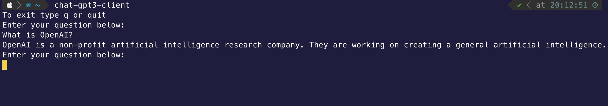

## The Go CLI for ChatGPT-3 (https://chat.openai.com)
======================

Install
======================

1. Request your OpenAPI key in [https://platform.openai.com/account/api-keys](https://platform.openai.com/account/api-keys)
2. `export API_KEY=<YOUR_KEY>`
3. `go install -x github.com/zfirdavs/chat-gpt3-client@latest`

Usage
======================
`chat-gpt3-client`  

